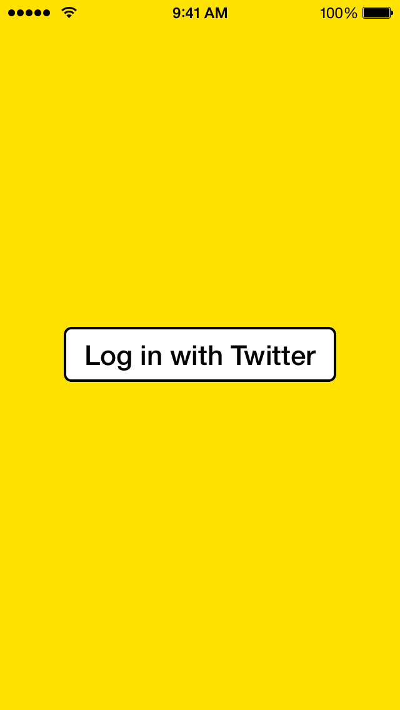

## MeerkatButton

### What is this?

[Meerkat](https://itunes.apple.com/us/app/meerkat-tweet-live-video/id954105918?mt=8&uo=4 "Meerkat") is an iOS app to "Tweet Live Video".

I liked the look of the "Log in" button within the app so I created a replica by subclassing `UIButton`.

### How do I use it?

Simply drag-and-drop `MeerkatButton.h` and `MeerkatButton.m` into your Xcode project.

Create a `MeerkatButton` programmatically or drag-and-drop a `UIButton` into a xib or storyboard and then change the class to `MeerkatButton`.

### Screenshot

</img>

### License

The MIT License (MIT)